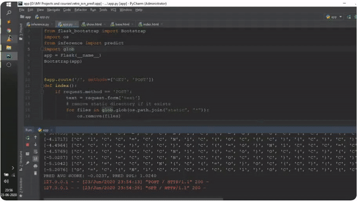

# Retrosynthesis-Reaction-Pathway

The web application generates complete breakdown pathways for the given product molecule.

For inference purpose a checkpoint created after 44000 steps is provided [here](https://drive.google.com/file/d/1qGnw2MLGhgtYaNb_Gn_xUKW_VKPhJt7K/view?usp=sharing).


## Installations

1) rdkit
2) OpenNMT


## Dataset Generation

Clone the [OpenNMT repo](https://github.com/OpenNMT/OpenNMT-py)

Follow the setup instructions in the repo.


Datasets can be downloaded [here](https://www.dropbox.com/s/ze4bdif8sqjx5jx/Retrosynthesis%20Data.zip?dl=0)

Datasets should be plcaed in the `data` directory in the `OpenNMT-py` directory using a different data folder for each version of the dataset (no augmentation, 4x, 16x and 40x augmentation)

In the `OpenNMT-py` directory, run the following command:

    python preprocess.py -train_src data/{dataset_directory}/{train_source}.txt \
    -train_tgt data/{dataset_directory}/{train_targets}.txt -valid_src data/{dataset_directory}/{valid_source}.txt \
    -valid_tgt data/{dataset_directory}/{valid_targets}.txt -save_data data/{dataset_directory}/{dataset_name} \
    -src_seq_length 1000 -tgt_seq_length 1000 -src_vocab_size 1000 -tgt_vocab_size 1000 -share_vocab

## Model Training

Move the `model_config.yml` file in this directory to the `config` directory in the `OpenNMT-py` directory.

Update the `data` and `save_model` fields for the dataset created above

In the `OpenNMT-py` directory, run the following command:

    python train.py -config config/model_config.yml

## Running the web app

1) Download the model in the ```Retrosynthesis-Reaction-Pathway``` directory. If you have created your own model then change the model path [here](https://github.com/QuickLearner171998/Retrosynthesis-Reaction-Pathway/blob/ea3ce4627a65a4ecac6f39a9f04606f56bae484a/utils.py#L24).
2) Run ```python app.py``` and vsit the link displayed on the terminal/Command prompt.
3) Enter the correct SMILES in the text box and click on upload.
4) The molecule visualisation and the complete pathway will be shown.

## Demo


## TODO

- [ ] Improve the frontend.
- [ ] Add option to enter IUPAC name instead of SMILES as input.
